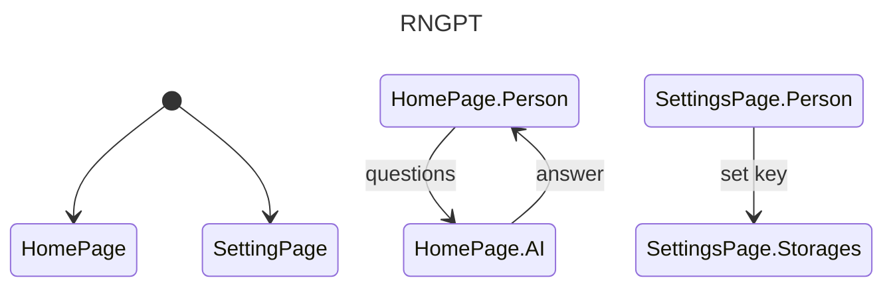
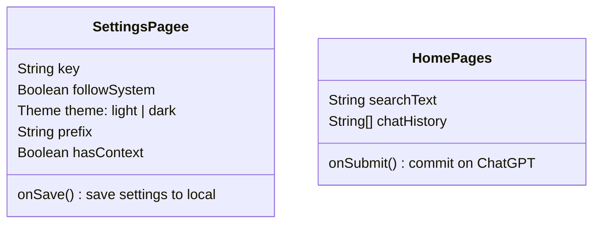

## React Native GPT APP for myself

a learning repository that use react-native for chatgpt

🌟 Inspiration comes from [milady](https://github.com/nohr/milady)

## Future

- UI design
- UX design
- Docking gpt 
- Setting key
- Support prefix
- Multi-scene prefix

## Structure

